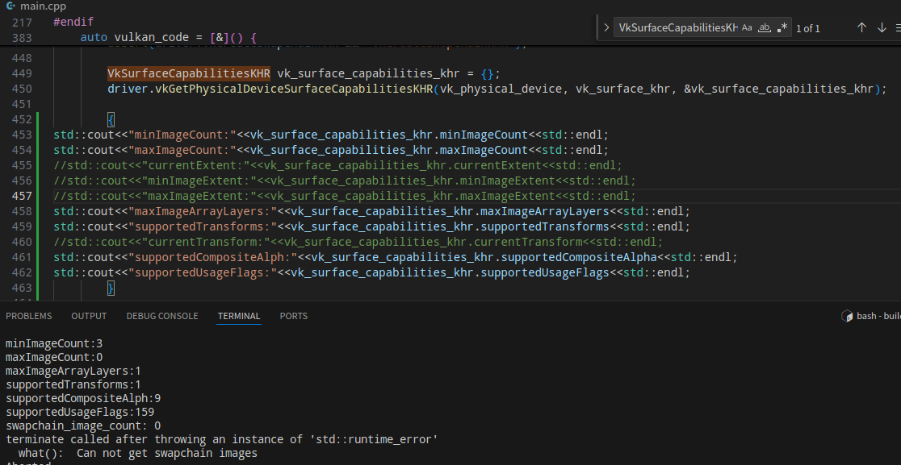

# Vulkan Triangle

该项目是使用纯 `Vulkan` 接口在 `Windows` 和 `Linux` 平台下渲染一个三角形的示例程序。只用于学习，禁止用于商业。

## 说明

不需要配置任何环境，直接使用 `CMake` 导出工程编译即可。

将会输出 `VulkanTriangle.exe` 可执行程序。

## 作者

[FuXii](https://github.com/FuXiii)

### 开源项目

* [Turbo  引擎](https://github.com/FuXiii/Turbo)

* [Vulkan 入门精要](https://fuxiii.github.io/Essentials.of.Vulkan/index.html)

### 日志

> **2024/11/18**
>
> >尝试适配 `Swapchain` 大小改变。
>
> >优化代码结构

> **2024/11/15**
>
> >`MacOS` 系统成功编译。

> **2024/11/14**
>
> >动态判断加载 `Layer` 和 `Extension`
>
> >适配了一版 `苹果` 系统，还未进行测试，不知是否可行。

> **2024/11/13**
>
> 成功适配 `Deepin V23`
>
> >安装如下
> >
> > ``` console
> > libx11-dev
> > libxrandr-dev 
> > libxinerama-dev
> > libxcursor-dev
> > libxi-dev
> > freeglut3-dev
> > ```
>
> > `VK_LAYER_KHRONOS_validation` 验证层找不到，非必须，目前暂时注释掉，`修改意见：` 增加 `vkEnumerateInstanceLayerProperties(...)` 的使用。
>
> > `vkGetPhysicalDeviceSurfaceCapabilitiesKHR(...)` 获取到的 `VkSurfaceCapabilitiesKHR::minImageCount` 不为 `0` 而 `VkSurfaceCapabilitiesKHR::maxImageCount` 为 `0`。
>>
>> 
>>
>> 增加了如下判断
>>
>> ```cpp
>>vk_swapchain_create_info_khr.minImageCount = std::max(vk_surface_capabilities_khrminImageCount, vk_surface_capabilities_khr.maxImageCount);
>> ```
